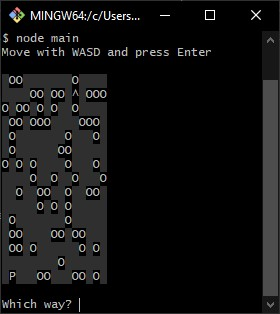

# Find your hat
An interactive terminal game with JavaScriot classes. The project is centered on a ```Game``` class which contains two subclasses ```Field``` and ```Player```.

In the game, the player must find his hat by travelling through the field but being careful not to fall into a hole or getting out of bounds.

The field is bidimensional and is made of dirt, holes, travelled path, player and the hat. Each represented with a character.

## Table of contents
* [General info](#general-info)
* [Screenshots](#screenshots)
* [Technologies](#technologies)
* [Preview](#preview)
* [Status](#status)
* [Sources](#sources)
* [Contact](#contact)

## General info
The project consists in creating a maze-puzzle game
 
The field consists in a 2D array which contains the maze where
the player travels around.
The field has the following characters:

* Field ░
* Path *
* Player P
* Holes O
* Hat ^

The player starts at a random position and must find his hat (^). He is leaving a tray behind him in form of a path (*) and can travel through the field (░). But must be careful not to fall into a hole (O).

The game ends when the player:
* Wins by finding his hat
* Loses by landing on (and falling in) a hole
* Attempts to move outside the field
 

## Screenshots


## Technologies
* JavaScript ES6
* Git- version 2.30.0
* prompt-sync 4.2.0

## Preview
Use **Node.js** in the command line to run the program.

```node main.js```

## Status
Project is: _Finished_

## Sources
This app is inspired by the _Find Your Hat_ project from the _Full-Stack Engineer Career Path_ of [Codecademy](https://www.codecademy.com)

## Contact
Created by [@didash20](https://github.com/didash20)